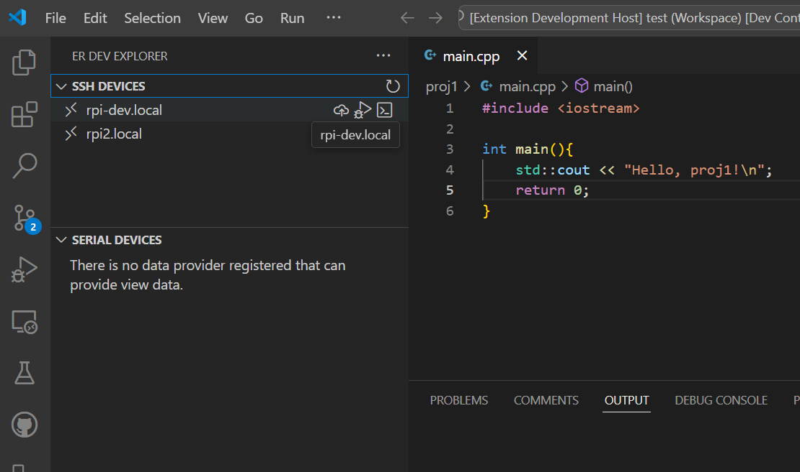
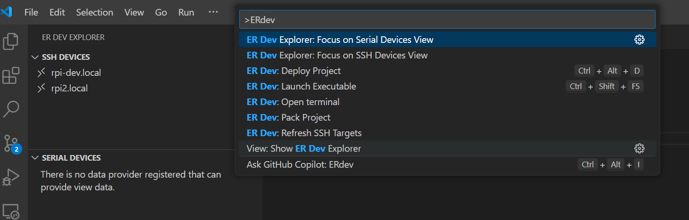

# Effective Range Development extension README

This is the README for extension "erdev". This extension facilitates incremental development for the Effective-Range LLC. devices. This extensions is targeting development on debian based systems
where software is distributed in `.deb` packages. The extension currently is capable of handling software projects types:

-   C/C++ using CMake, configured with CPack for debian package generation
-   Python packages with setup.py, where the solution is packaged into debian using `fpm`

The extension supports:

-   packaging
-   deploying
-   remote debugging

for all supported projects types.

For further development workflow and other details please see the [wiki](https://github.com/EffectiveRange/vscodeext-er-dev/wiki)

## Requirements

The extension was targeted be used inside an Effective Range dev container for proper operation, but since only vanilla Debian based tooling used, it can be used for any supported project types for remote deployment and debugging.

If your project uses the [Effective Range devcontainer definitions](https://github.com/EffectiveRange/devcontainer-defs) then all the prerequisites are installed there when you open your project with one of the devcontainers. Otherwise the following tools have to be installed on your machine:

-   python3 interpreter with pip
-   cmake
-   [fpm](https://fpm.readthedocs.io/en/latest/), if you have a python project and opt for the fpm based packaging
-   [stdeb](https://pypi.org/project/stdeb/), if you have a python project and opt for the dhvirtualenv based packaging
-   ssh client for remote deployment and debugging

## Features

This extension has the following features:

-   ER Dev explorer: Tree view listing various devices, that can be used as targets for deployment. Currently only SSH based targets are supported
    -   The hosts are sourced from an ssh config file, that can be specified in the extension configuration.
    -   In the explorer you can select one or more targets (ctrl+ click)
    -   The active selection is displayed in the status bar
    -   For each row, there's a deploy icon, to trigger the deployment to the target
    -   When the ssh config file has changed on disk, you can trigger a reload of the contents by clicking the refresh icon, or invoking the command from the palette

-   ER Pack:
    -   The packaging relies on the [Effective Range packaging project](https://github.com/EffectiveRange/packaging-tools) for uniform packaging
        -   The cmake packaging is driven by the project's CPack settings, and currently it must produce a debian package as an output
        -   The python packaging is driven by the project's `setup.cfg` file, all the details are available in the [packaging project documentation](https://github.com/EffectiveRange/packaging-tools/blob/main/python/README.md) documentation
    -   This command can be used to pack the active project
    -   The command can be invoked from the command palette
    -   The command can be invoked from the status bar button
-   ER Deploy:
    -   This command deploys the active project to the selected devices
    -   similarily can be invoked from both the palette and the status bar button
    -   The extension registers `Ctrl+Alt+d` as the default keybinding to invoke this command
-   ER Launch:
    -   This command is able to launch a remote debugging session on the selected target device. If a project has multiple binary executable targets, then a popup will be presented to select the launch target.
    -   The extension registers `Ctrl+Alt+F5` as the default keybinding to invoke this command
-   ER Open Terminal:
    -   Opens a terminal session to the selected device
    -   Available from the command palette, which always prompts for the target device if there is more than one targets available
    -   Available from the tree view, as an inline command for each row of targets

## Extension Settings

This extension contributes the following settings:

-   `erdev.sshconfig`: the path to the ssh configuration that defines the hosts for the devices, defaults to `~/.ssh/config`.

## Known Issues

## Feature roadmap

The following features will be added in the feature

-   dynamically detect the remote machine interpreter path if dhvirtualenv based packaging is in place
-   Remote debugger attach for the selected host with process pick, etc for python and C++ debugging
-   Support serial connection targets to utilize the UART capabilities of the MrHAT
-   Support for ansible dynamic/static inventory targets

---

<!-- ## Following extension guidelines

Ensure that you've read through the extensions guidelines and follow the best practices for creating your extension.

* [Extension Guidelines](https://code.visualstudio.com/api/references/extension-guidelines)

## Working with Markdown

You can author your README using Visual Studio Code. Here are some useful editor keyboard shortcuts:

* Split the editor (`Cmd+\` on macOS or `Ctrl+\` on Windows and Linux).
* Toggle preview (`Shift+Cmd+V` on macOS or `Shift+Ctrl+V` on Windows and Linux).
* Press `Ctrl+Space` (Windows, Linux, macOS) to see a list of Markdown snippets.

## For more information

* [Visual Studio Code's Markdown Support](http://code.visualstudio.com/docs/languages/markdown)
* [Markdown Syntax Reference](https://help.github.com/articles/markdown-basics/)

**Enjoy!** -->
